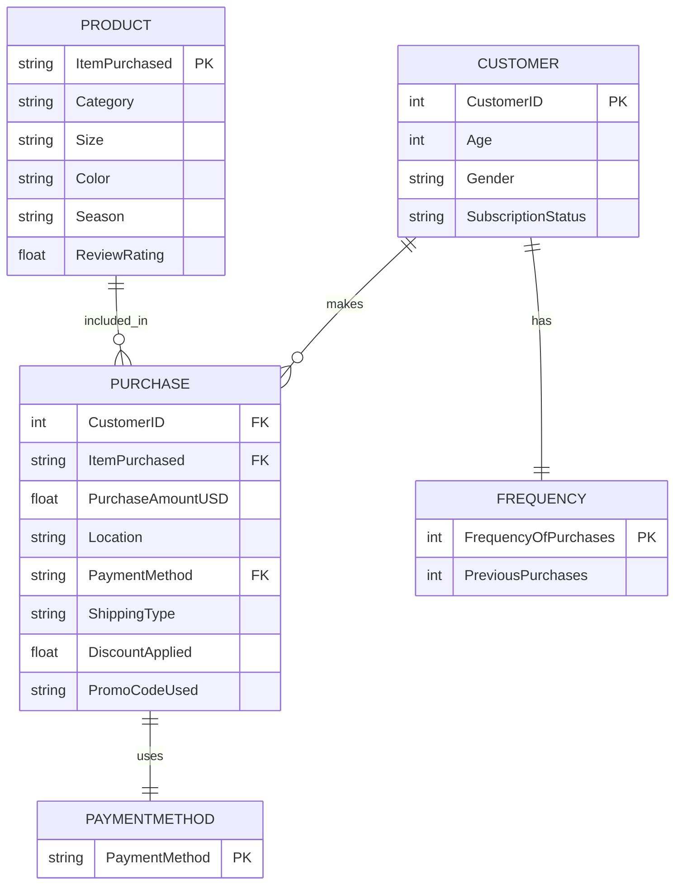

# AdvancedDatabaseHW3

# **HW3 - ER Models**

## **Project Overview**
This project focuses on analyzing the `shopping_trends.csv` dataset to extract relevant **Entities, Attributes, and Relationships** for database design. The final output includes an **Entity-Relationship (ER) Model** using **Crow’s Foot Notation** and structured dataset attributes.

## **Files in This Repository**
- `Databases_HW3.qmd` - Quarto file containing the analysis, ER model, and dataset insights.
- `shopping_trends.csv` - The input dataset used for entity extraction.
- `Databases_HW3.html` - Rendered HTML output of the Quarto file.
- `README.md` - Project documentation (this file).

## **Authors**
- **Tejesh Annavarapu**
- **Srujan Katukam**
- **Anumandla Muralidhar Reddy**
- **Ajaykumar Reddy Rachala**

## **Instructor**
- **Thomas Gyeera** (CMSC 608 - Advanced Database Systems)

## **GitHub Repository**
👉 **[AdvancedDatabaseHW3 Repository](https://github.com/Tejesh18/AdvancedDatabaseHW3)**

## **Setup Instructions**
To generate the HTML output from the `.qmd` file, follow these steps:

### **Using Quarto in VS Code**
1. Open the terminal and navigate to the project directory:
   ```sh
   cd "c:/Users/91630/Desktop/VCU/2nd sem/Advanced Database/"
   ```
2. Run the following command to render the QMD file into an HTML file:
   ```sh
   quarto render Databases_HW3.qmd --to html
   ```
3. The `Databases_HW3.html` file will be generated in the same directory.

### **Alternative: Using R in VS Code**
1. Open an R session in VS Code.
2. Install Quarto (if not installed):
   ```r
   install.packages("quarto")
   ```
3. Render the QMD file:
   ```r
   quarto::quarto_render("Databases_HW3.qmd", output_format = "html")
   ```

## **Entity-Relationship Model (ER Model)**
The ER model identifies the following **entities, attributes, and relationships**:

### **Identified Entities and Attributes**

#### **1. Customer**
*   CustomerID (Primary Key)
*   Age
*   Gender
*   Subscription Status

#### **2. Product**
*   ItemPurchased (Primary Key)
*   Category
*   Size
*   Color
*   Season
*   Review Rating

#### **3. Purchase**
*   CustomerID (Foreign Key)
*   ItemPurchased (Foreign Key)
*   PurchaseAmountUSD
*   Location
*   PaymentMethod
*   ShippingType
*   DiscountApplied
*   PromoCodeUsed

#### **4. PaymentMethod**
*   PaymentMethod (Primary Key)

#### **5. Frequency**
*   FrequencyOfPurchases (Primary Key)
*   PreviousPurchases

### **Relationships**
- **A Customer can make multiple Purchases** (1:M)
- **A Product can be part of multiple Purchases** (1:M)
- **A Purchase uses one Payment Method** (1:1)
- **A Customer has one Frequency** (1:1)

## **ER Model Diagram**
The ER Model is represented using **Crow’s Foot Notation**:


## **Conclusion**
This project successfully extracts entities, attributes, and relationships from a dataset and represents them using **Crow’s Foot Notation**. The structured schema can be used to create normalized **database tables**, ensuring efficient querying and data integrity.

🚀 Happy Coding! Let us know if you have any questions. 🎯
